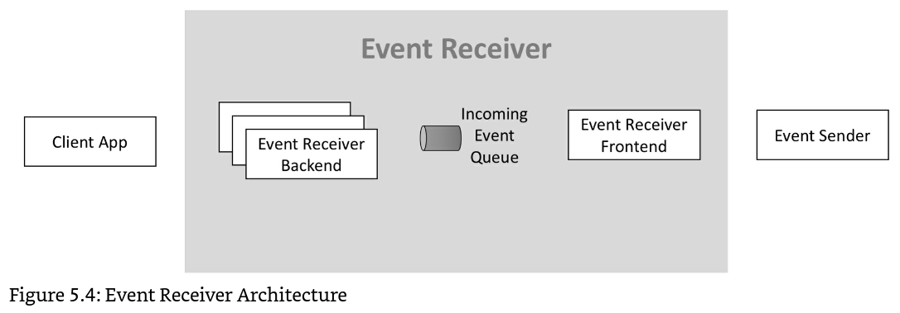
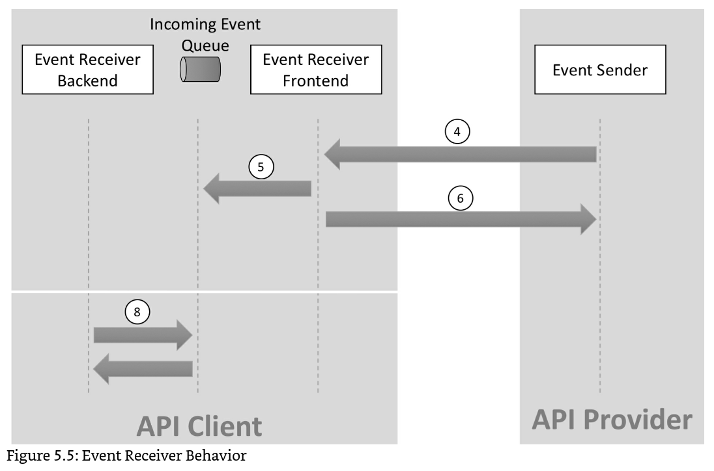

# masterTime API for Software 3rd-Party Documentation (v0.9.0)

Last Updated : `10 March 2022`

## หัวข้อ

- [ข้อมูลเบื้องต้น](#ข้อมูลเบื้องต้น)
- [Root Endpoint](#root-endpoint)
- [Client](#client)
- [Error](#error)
- [การ Login ของ Client](#การ-login-ของ-client)
- [Refresh Token และ Access Token](#refresh-token-และ-access-token)
    - [Refresh Token](#refresh-token)
    - [Access Token](#access-token)
    - [การเรียกใช้ API ด้วย Access Token](#การเรียกใช้-api-ด้วย-access-token)
    - [การขอ Access Token ใหม่ ด้วย Refresh Token](#การขอ-access-token-ใหม่-ด้วย-refresh-token)
- [API ที่สามารถใช้งานได้](#API-ที่สามารถใช้งานได้)
    - [การเพิ่มพนักงานใหม่](#การเพิ่มพนักงานใหม่)
    - [การให้สิทธิ์พนักงานลงเวลานอกสถานที่](#การให้สิทธิ์พนักงานลงเวลานอกสถานที่)
- [Webhooks](#webhooks)
    - [Basic Authentication](#basic-authentication)
    - [Events](#events)
        - [New Transaction Event](#new-transaction-event)

## ข้อมูลเบื้องต้น

- API ของ masterTime เป็น `RESTful`
- Request Body และ Response Body เป็น `JSON`
- เราใช้ `HTTP Response Status Code` เพื่อบอกว่าการ `Request` นั้น `Success` หรือ `Error` ตามความหมายของโค้ดนั้น ๆ
- API ของ masterTime ยอมรับ `https` เท่านั้น

## Root Endpoint ของ masterTime

```
https://api.mastertime.io/api/v1/
```

## Client

- `Client` คือ Software ที่ต้องการเชื่อมต่อกับระบบ masterTime
- ทาง developer ของ masterTime จะสร้าง Account ให้สำหรับ Software 3rd-Party ที่ต้องการเชื่อมต่อกับ masterTime
- ผู้พัฒนา Software 3rd-Party จะได้รับ `Client ID` และ `Client Secret` เพื่อให้ Client ใช้ในการ Login

## Error

ในระบบ masterTime เมื่อ return `HTTP Response Status Code` เป็น `4xx` หรือ `5xx` จะมี `Response Body` ดังนี้

```json
{
  "status": 500,
  "message": "some messages that the programmer can describe this error",
  "time": "2022-03-01T11:08:34.318Z",
  "log_id": "string",
  "error_code": "string",
  "error_args": {}
}
```

#### คำอธิบาย

| ชื่อ Field | คำอธิบาย                                                                                 |
|------------|------------------------------------------------------------------------------------------|
| status     | `Number` ที่เป็น `Integer` ตรงกับ `HTTP Response Status Code` ที่ return กลับมา          |
| message    | ข้อความที่อธิบายสาเหตุของ error                                                          |
| time       | เวลาที่เกิด error (ใช้มาตรฐาน [RFC 3339](https://datatracker.ietf.org/doc/html/rfc3339)) |
| log_id     | Log ID ในระบบ masterTime สำหรับแต่ละ Request                                             |
| error_code | รหัสสำหรับแต่ละ Error ที่เกิดขึ้นในระบบ masterTime                                       |
| error_args | ยังไม่ใช้งาน (ตอนนี้จะส่งกลับมาเป็น `NULL` เสมอ)                                         |

## การ Login ของ Client

ก่อนที่ Client จะสามารถสื่อสารกับ masterTime ได้ จะต้อง login ก่อน

#### Endpoint

`/auth/login/software3rdparty`

#### Request Body

```json
{
  "app_id": "string",
  "secret": "string",
  "login_type_id": 3,
  "company_uuid": "string"
}
```

##### คำอธิบาย

| ชื่อ Field    | คำอธิบาย                                                       |
|---------------|----------------------------------------------------------------|
| app_id        | Client ID ที่ masterTime กำหนดให้                              |
| secret        | Client Secret ที่ masterTime กำหนดให้                          |
| login_type_id | ประเภทของการ Login ซึ่ง Software 3rd-Party ต้องส่งค่า `3` เสมอ |
| company_uuid  |                                                                |

#### Response

##### 200 (Login สำเร็จ)

```json
{
  "refresh_token": "eyJDb21wYW55SUQiOjEsIkVtcGxMeWVlSUQiOjAA=",
  "access_token": "4N2UyMmIzOWFlMDUyOGQ0M2QyMmJkMDRjZTgzMWM=",
  "company": {
    "company_uuid": "string",
    "company_code": "string",
    "title_th": "string",
    "title_en": "string"
  },
  "login_type": {
    "login_type_id": 3,
    "title_th": "แอพพลิเคชั่นซอฟต์แวร์",
    "title_en": "Software Application"
  },
  "developer": null,
  "taff_admin": null,
  "company_admin": null,
  "employee": null,
  "hardware": null,
  "software_3rd_party": {
    "app_id": "{Client ID}",
    "is_active": true
  },
  "mobile_unique_code": "",
  "vendor": "",
  "model": "",
  "web_browser": "",
  "os_version": "",
  "sw_version": ""
}
```

ให้ Client เก็บ `refresh_token` และ `access_token` ไว้ เพื่อเรียกใช้งาน API ของ masterTime ต่อไป

##### 400 (Bad Request)

- `Request` ไม่ถูกต้อง

##### 401 (Unauthorized)

- Login ไม่สำเร็จ, `Client ID` หรือ `Client Secret` อาจจะผิด

##### 403 (Forbidden)

- การยืนยันตัวตนสำเร็จ แต่ระบบ masterTime ไม่ให้ `Client ID` นี้ใช้งาน

#### 500 (Internal Server Error)

- เกิดข้อผิดพลาดในระบบ masterTime

## Refresh Token และ Access Token

เมื่อ Client ทำการ Login สำเร็จ จะได้รับ `refresh_token` และ `access_token` เพื่อเรียกใช้งาน API ของ masterTime ต่อไป

### Refresh Token

เป็น `token` ที่มีอายุค่อนข้างยาว ใช้สำหรับขอ `access_token` ใหม่ เมื่อ `access_token` หมดอายุ

### Access Token

เป็น `token` ที่มีอายุค่อนข้างสั้น ใช้สำหรับเรียกใช้ API ของ masterTime โดยจะต้องแนบ `access_token`
ใน `HTTP Authorization` header โดยใช้เป็น `bearer token`

## การเรียกใช้ API ด้วย Access Token

Client ต้องแนบ `access_token` ใน `HTTP Authorization` header โดยใช้เป็น `bearer token` ทุกครั้งที่เรียก API ของ
masterTime

ซึ่งในการเรียกใช้งาน API แต่ละครั้ง จะมีการตรวจสอบสิทธิ์การใช้งานจาก `access_token`

ซึ่งมีโอกาสที่ `access_token` จะใช้งานไม่ได้ ดังนี้

#### 2xx (Success)

- การ Request ของ Client สำเร็จ และจะได้รับผลลัพธ์กลับมาทาง Request Body

#### 401 (Access Token is invalid)

- ในกรณีนี้หมายถึง Access Token หมดอายุ, Client จะต้องขอ Access Token ใหม่ ด้วย Refresh Token (
  ดู [การขอ Access Token ใหม่ ด้วย Refresh Token](#การขอ-access-token-ใหม่-ด้วย-refresh-token))

#### 403 (No Permission)

- ในกรณีนี้หมายถึง Access Token นี้ไม่มีสิทธิ์ในเรียกใช้งาน API ดังกล่าว

## การขอ Access Token ใหม่ ด้วย Refresh Token

เมื่อ Access Token หมดอายุ, Client จะต้องขอ Access Token ใหม่ ด้วย Refresh Token โดยมีรายละเอียดดังนี้

#### Endpoint

`/auth/request-access-token`

#### HTTP Method

`POST`

#### Request Body

```json
{
  "refresh_token": "{refresh_token}"
}
```

#### Response

##### 200 (Success)

```json
{
  "refresh_token": "eyJDb21wYW55SUQiOjEsIkVtcGxMeWVlSUQiOjAA=",
  "access_token": "4N2UyMmIzOWFlMDUyOGQ0M2QyMmJkMDRjZTgzMWM="
}
```

- ให้ Client เก็บ `refresh_token` และ `access_token` ไว้ เพื่อเรียกใช้งาน API ของ masterTime ต่อไป

##### 401 (Unauthorized)

- Client จะได้รับ `401` เมื่อขอ `Access Token` ใหม่ `ไม่สำเร็จ`, Client จะต้อง Login อีกครั้ง (
  ดู [การ Login ของ Client](#การ-login-ของ-client))

## API ที่สามารถใช้งานได้

ระบบ masterTime ให้ Software ภายนอกที่ได้รับอนุญาต สามารถเรียกใช้งาน API ได้

โดยการเรียก API ทุกครั้ง Client ต้องแนบ `access_token` ใน `HTTP Authorization` header โดยใช้เป็น `bearer token`
มาด้วยทุกครั้ง (ดู [การเรียกใช้ API ด้วย Access Token](#การเรียกใช้-api-ด้วย-access-token))

API ที่สามารถใช้งานได้ มีดังนี้

## การเพิ่มพนักงานใหม่

### Endpoint

`/function/new-employee`

### HTTP Method

`POST`

### Request Body

```json
{
  "company_uuid": "string",
  "employee_code": "string",
  "employee_firstname_th": "string",
  "employee_lastname_th": "string",
  "employee_firstname_en": "string",
  "employee_lastname_en": "string",
  "organization_code": "string",
  "position_code": "string",
  "employee_type_code": "string",
  "shift_code": "string",
  "role_code": "string"
}
```

#### คำอธิบาย

| ชื่อ Field            | คำอธิบาย                                                     |
|-----------------------|--------------------------------------------------------------|
| company_uuid          | UUID ของบริษัทที่ต้องการเพิ่มพนักงานใหม่                     |
| employee_code         | รหัสพนักงาน                                                  |
| employee_firstname_th | ชื่อจริง (ภาษาไทย)                                           |
| employee_lastname_th  | นามสกุล (ภาษาไทย)                                            |
| employee_firstname_en | ชื่อจริง (ภาษาอังกฤษ)                                        |
| employee_lastname_en  | ชื่อจริง (ภาษาอังกฤษ)                                        |
| organization_code     | รหัสของหน่วยงาน (ต้องตรงกับที่กรอกไว้ในระบบ masterTime)      |
| position_code         | รหัสของตำแหน่ง (ต้องตรงกับที่กรอกไว้ในระบบ masterTime)       |
| employee_type_code    | รหัสของประเภทพนักงาน (ต้องตรงกับที่กรอกไว้ในระบบ masterTime) |
| shift_code            | รหัสของกะการทำงาน (ต้องตรงกับที่กรอกไว้ในระบบ masterTime)    |
| role_code             | รหัสของสิทธิ์การใช้งาน ในตอนนี้ต้องส่งค่า `NULL`             |

### Response

#### 200 (Successful)

- การเพิ่มพนักงานใหม่สำเร็จ

#### 400 (Bad Request)

- `Request` ไม่ถูกต้อง

#### 401 (Access Token is invalid)

- `Access Token` หมดอายุ, Client จะต้องขอ `Access Token` ใหม่ ด้วย `Refresh Token` ก่อนที่จะกลับมาเรียกใช้ API
  นี้อีกครั้ง (
  ดู [การขอ Access Token ใหม่ ด้วย Refresh Token](#การขอ-access-token-ใหม่-ด้วย-refresh-token))

#### 403 (No Permission)

- ในกรณีนี้หมายถึง Access Token ที่แนบมา ไม่มีสิทธิ์ในเรียกใช้งาน API นี้

#### 409 (Conflict)

- ในระบบ masterTime มีรหัสพนักงานนี้อยู่แล้ว (รหัสพนักงานซ้ำ)

#### 500 (Internal Server Error)

- เกิดข้อผิดพลาดในระบบ masterTime

## การให้สิทธิ์พนักงานลงเวลานอกสถานที่

### Endpoint

`/function/grant-time-attendance-offsite`

### HTTP Method

`POST`

### Request Body

```json
{
  "company_uuid": "string",
  "employee_code": "string"
}
```

#### คำอธิบาย

| ชื่อ Field    | คำอธิบาย                                                 |
|---------------|----------------------------------------------------------|
| company_uuid  | UUID ของบริษัทที่ต้องการให้สิทธิ์พนักงานลงเวลานอกสถานที่ |
| employee_code | รหัสพนักงาน                                              |

### Response

#### 200 (Successful)

- การให้สิทธิ์พนักงานลงเวลานอกสถานที่สำเร็จ

#### 400 (Bad Request)

- `Request` ไม่ถูกต้อง

#### 401 (Access Token is invalid)

- `Access Token` หมดอายุ, Client จะต้องขอ `Access Token` ใหม่ ด้วย `Refresh Token` ก่อนที่จะกลับมาเรียกใช้ API
  นี้อีกครั้ง (
  ดู [การขอ Access Token ใหม่ ด้วย Refresh Token](#การขอ-access-token-ใหม่-ด้วย-refresh-token))

#### 403 (No Permission)

- ในกรณีนี้หมายถึง Access Token ที่แนบมา ไม่มีสิทธิ์ในเรียกใช้งาน API นี้

#### 500 (Internal Server Error)

- เกิดข้อผิดพลาดในระบบ masterTime

# Webhooks

**หมายเหตุ :** หลังจากนี้ masterTime จะมีรายละเอียดเกี่ยวกับ Webhooks ใน `Developer Portal` ด้วย

ระบบ masterTime ให้บริการ `Event` ผ่านกลไกของ `Webhooks` เพื่อให้ผู้ที่เชื่อมต่อกับระบบ masterTime ได้รับข้อมูลแบบ
`Real-time` โดยมีข้อตกลงเบื่องต้นดังนี้

- ผู้ที่ต้องการรับ Event จาก masterTime จะต้องเป็น Server (`Webhooks receiver`)
- masterTime จะเป็น Client
- `Webhooks receiver` ต้องรองรับ `https` เท่านั้น
- masterTime จะ request ไปด้วย `POST` method
- masterTime จะส่งข้อมูลของ Event ไปใน `Request Body`
- ผู้ที่ต้องการรับ Event จาก masterTime จะต้องเตรียม `Endpoint` ไว้รับแต่ละ `Event` ที่ลงทะเบียน (Subscription) ไว้กับ
  masterTime
- ทุกครั้งที่ masterTime ส่ง Event ไปให้, masterTime จะส่ง `Basic Authentication` ไปใน `HTTP Authorization` header
  โดยใช้เป็น `Basic authentication` ทุกครั้ง
- Event Receiver ต้องตรวจสอบ `IP Whitelist` ของ masterTime เสมอ
- Event Receiver ต้องเป็น `Idempotent` คือ ระบบ masterTime อาจส่ง Event เดิมซ้ำมาหลายครั้ง, Event Receiver
  ต้องสามารถจัดการได้โดยไม่เกิดปัญหา

## Basic Authentication

- ผู้ที่ต้องการรับ Event จาก masterTime จะต้องกำหนด `Username` และ `Password` ให้กับ masterTime
- masterTime จะส่ง Basic Authentication ไปใน `HTTP Authorization` header ทุกครั้งที่ส่ง Event ดังนี้

```
Authorization: Basic {BASE64_ENCODED(Username:Password)}
```

## Timeout 5 วินาที

เมื่อ masterTime ส่ง Event ให้ Event Receiver จะมี `timeout 5 วินาที` ถ้าหาก masterTime ไม่ได้รับ response
ในเวลาที่กำหนดจะถือว่าเกิด Timeout

## Retry Mechanism

เมื่อเกิด Timeout ขึ้น masterTime จะพยายามส่ง Event เดิมทั้งหมด 10 ครั้ง โดยการส่งแต่ละครั้งจะนานขึ้นเรื่อย ๆ
ซึ่งจะห่างกัน
$2^N$ milliseconds (Back-off algorithm)

โดยที่

- N = delivery_attempt - 1 

delivery_attempt คือ จำนวนครั้งที่พยายามส่ง Event นี้

## การหยุดส่ง Event

masterTime จะหยุดส่ง Event เมื่อ

- masterTime ได้รับ response 4XX หรือ 5XX
- masterTime พยายามส่ง Event เดิมครบ 10 ครั้ง และไม่ได้รับ response `202 Accepted`

## Events

**Event Header**

- masterTime จะส่ง Basic Authentication ไปใน `HTTP Authorization` header ทุกครั้งที่ส่ง Event ดังนี้

```
Authorization: Basic {BASE64_ENCODED(Username:Password)}
```

**Event body**

```json
{
  "event_uuid": "4f90f1ee-6c54-4b01-90e6-d701748f08534",
  "topic": "employee.transaction.mobile",
  "latest_delivery": "2017-08-29T09:12:33.001Z",
  "first_delivery": "2017-08-29T09:12:33.001Z",
  "delivery_attempt": 2,
  "delivery_state": "open",
  "subscription_uuid": "4f90f1ee-6c54-4b01-90e6-d701748f08534",
  "affected_resource": "api.mastertime.io/v1/resources/transaction/4f90f1ee-6c54-4b01-90e6-d701748f08534",
  "payload": {}
}
```

#### คำอธิบาย

| ชื่อ Field        | คำอธิบาย                                   |
|-------------------|--------------------------------------------|
| event_uuid        | UUID ของ Event                             |
| topic             | Topic ของ Event                            |
| latest_delivery   | วันที่ - เวลา ล่าสุดที่พยายามส่ง Event นี้ |
| first_delivery    | วันที่ - เวลา ครั้งแรกที่ส่ง Event นี้     |
| delivery_attempt  | จำนวนครั้งที่พยายามส่ง Event นี้           |
| delivery_state    | สถานะของ Event นี้                         |
| subscription_uuid | UUID ของผู้ Subscribe Event นี้            |
| affected_resource | URI ของ Resource ที่ส่งมาใน Payload        |
| payload           | ข้อมูลของ Event นี้                        |

##### อธิบาย `delivery_state` เพิ่มเติม

| delivery_state | คำอธิบาย                                                                                                 |
|----------------|----------------------------------------------------------------------------------------------------------|
| open           | Event ที่ masterTime ยังพยายามส่งให้ Event Receiver อยู่ โดยที่ยังไม่สำเร็จหรือยกเลิกการส่งแล้ว          |
| successfully   | Event ที่สำเร็จแล้ว                                                                                      |
| error          | Event ที่ Event Receiver ตอบ Error กลับมา                                                                |
| timeout        | Event ที่ Event Receiver ไม่ตอบกลับมาในเวลาที่ masterTime กำหนด                                          |
| not-delivered  | Event ที่ masterTime ไม่ส่งให้ Event Receiver เช่น การ Subscribe ของ Event Receiver ถูก Disable ชั่วคราว |

**หมายเหตุ :** Events ที่ masterTime จะส่งไปที่ Event Receiver โดยทั่วไปจะเป็น `open` เสมอ

## Topics (Event Types) ทีมีให้บริการ

ระบบ masterTime มี Event types สำหรับ Web Hooks ไว้ให้บริการ ดังนี้

1. New Transaction from mobile app

## 1. Event : New Transaction from mobile app

Event นี้จะส่งเมื่อเกิด Transaction ใหม่ในระบบ masterTime จาก mobile application.

### Topic

```
"topic": "employee.transaction.mobile",
```

### Payload

```json
{
  "company_uuid": "string",
  "transaction_uuid": "string",
  "transaction_time": "2022-03-10T02:29:42Z",
  "timezone": "+07:00",
  "transaction_source": {
    "transaction_source_uuid": "string",
    "transaction_source_code": "string",
    "title_th": "string",
    "title_en": "string",
    "title_short": "string"
  },
  "company_event": null,
  "company_duty": {
    "company_duty_uuid": "string",
    "company_duty_code": "string",
    "title_th": "string",
    "title_en": "string",
    "duty_code": "string",
    "is_office": false,
    "is_display_on_mobile": true,
    "is_tracking_only": false,
    "duty_type": {
      "duty_type_id": 1,
      "title_th": "string",
      "title_en": "string"
    }
  },
  "company_location": {
    "company_location_uuid": "string",
    "company_location_code": "string",
    "title_th": "string",
    "title_en": "string",
    "latitude": "string",
    "longitude": "string",
    "radius_meter": 100,
    "timezone": "+07:00"
  },
  "time_attendance_offsite_grant": {
    "time_attendance_offsite_grant_uuid": "string",
    "time_attendance_offsite_grant_code": "string",
    "start_time": "2021-02-28T23:59:00Z",
    "end_time": "2021-02-28T23:59:00Z",
    "offsite_location": {
      "offsite_location_uuid": "string",
      "offsite_location_code": "string",
      "title_th": "string",
      "title_en": "string",
      "latitude": "string",
      "longitude": "string",
      "timezone": "+07:00"
    }
  },
  "hardware": {
    "hardware_uuid": "string",
    "hardware_code": "string",
    "title_th": "string",
    "title_en": "string",
    "hardware_serial_number": "string",
    "hardware_model": {
      "hardware_model_code": "string",
      "title": "string",
      "hardware_manufacturer": {
        "hardware_manufacturer_code": "string",
        "title": "string"
      }
    }
  },
  "employee": {
    "employee_uuid": "string",
    "employee_code": "string",
    "firstname_th": "string",
    "lastname_th": "string",
    "firstname_en": "string",
    "lastname_en": "string",
    "organization": {
      "organization_uuid": "string",
      "organization_code": "string",
      "title_th": "string",
      "title_en": "string"
    },
    "position": {
      "position_uuid": "string",
      "position_code": "string",
      "title_th": "string",
      "title_en": "string"
    },
    "employee_type": {
      "employee_type_uuid": "string",
      "employee_type_code": "string",
      "title_th": "string",
      "title_en": "string"
    },
    "shift": {
      "shift_uuid": "string",
      "shift_code": "string",
      "title_th": "string",
      "title_en": "string",
      "time_in": "08:00",
      "time_out": "17:00"
    },
    "role": {
      "role_uuid": "string",
      "role_code": "string",
      "title_th": "string",
      "title_en": "string"
    },
    "gender": {
      "gender_id": 1,
      "title_th": "string",
      "title_en": "string"
    },
    "company_prefix": {
      "company_prefix_uuid": "string",
      "company_prefix_code": "string",
      "title_th": "string",
      "title_en": "string"
    }
  },
  "card_serial_number": "string",
  "mobile_unique_code": "string",
  "latitude": "string",
  "longitude": "string",
  "license_plate": "string",
  "qr_code_3rdparty": "string",
  "url_photo": "string",
  "created": "2022-03-10T02:29:55.906267Z"
}
```

### Response

#### 202 (Accepted)

- ได้รับ Event สำเร็จ
- Event Receiver ควรเก็บ Event ลงใน Incoming Event Queue ก่อน แล้วตอบ `202 Accepted` กลับมาที่ masterTime
  เพื่อไม่ให้เกิน Timeout ที่กำหนด
- หลังจากนั้น Event Receiver ค่อยประมวนผล Event ใน Incoming Event Queue แบบ Asynchronous

#### 400 (Bad Request)

- `Request Body` ของ `Event` ที่ masterTime ส่งไป รูปแบบไม่ถูกต้อง
- ผู้รับ Event ต้องตรวจสอบว่า Implement ตามเอกสารล่าสุดของ masterTime หรือไม่

#### 401 (Unauthorized)

- `Username` และ `Password` ใน Basic Authentication ที่ masterTime ส่งไปใน `HTTP Authorization` header ไม่ถูกต้อง
- ผู้รับ Event ต้องตรวจสอบว่าระบุ `Username` และ `Password` ไว้ถูกต้องหรือไม่

#### 404 (Webhook not found / Topic not processed here)

- ไม่พบ Endpoint ของ Event Receiver
- หรือ Event Receiver Endpoint นี้ไม่รองรับ Topic ที่ส่งมา

#### 500 (Server Error)

- เกิดข้อผิดพลาดในระบบของผู้รับ Event

#### 503 (Server Error, Server is overloaded, try again later)

- Server is overloaded

## แนะนำการออกแบบ Architecture ของ Event Receiver Endpoint

### Event Receiver Architecture :



### Event Receiver Behavior :

