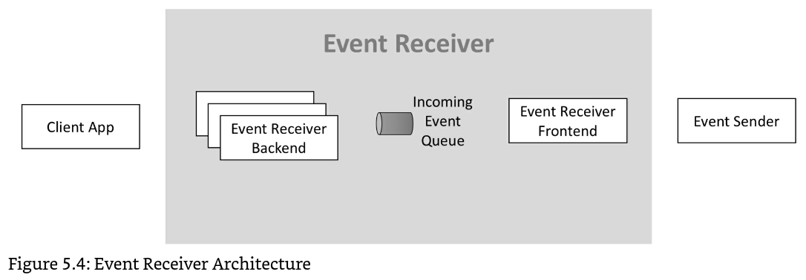
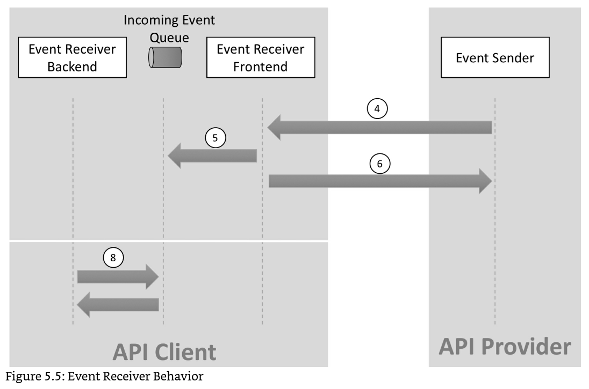

# Webhooks


## หัวข้อ

- [ข้อมูลเบื้องต้น](#ข้อมูลเบื้องต้น)
- [การกำหนด Receiver Endpoint](#การกำหนด-receiver-endpoint)
- [IP Whitelist](#ip-whitelist)
- [Basic Authentication](#basic-authentication)
- [Timeout](#timeout)
- [Retry Mechanism](#retry-mechanism)
- [การหยุดส่ง Event และการ Disable Subscription ชั่วคราว](#การหยุดส่ง-event-และการ-disable-subscription-ชั่วคราว)
- [การกลับมาส่ง Event และการ Enable Subscription อีกครั้ง](#การกลับมาส่ง-event-และการ-enable-subscription-อีกครั้ง)
- [การหยุดส่ง Event และการ Disable Subscription ถาวร](#การหยุดส่ง-event-และการ-disable-subscription-ถาวร)
- [Events](#events)
- [Confirmation Event](#confirmation-event)
- [Topics ที่มีให้บริการในระบบ masterTime](#topics-ที่มีให้บริการในระบบ-mastertime)
- [รายละเอียด Topics](#รายละเอียด-topics)
    - [1. New Transaction](#1-new-transaction)
- [แนะนำการออกแบบ Architecture ของ Webhooks Receiver Endpoint](#แนะนำการออกแบบ-architecture-ของ-webhooks-receiver-endpoint)
- [การทดสอบ Webhooks](#การทดสอบ-webhooks)
- [Developer Portal](#developer-portal)

## ข้อมูลเบื้องต้น

ระบบ masterTime ให้บริการ `Event` ผ่านกลไกของ `Webhooks` เพื่อให้ผู้ที่เชื่อมต่อกับระบบ masterTime ได้รับข้อมูลแบบ
`Real-time` โดยมีข้อตกลงเบื้องต้นดังนี้

- ผู้ที่ต้องการรับ Event จาก masterTime จะต้องเป็น Server (`Webhooks receiver`)
- masterTime จะเป็น Client
- `Webhooks receiver` ต้องรองรับ `https` เท่านั้น
- masterTime จะ request ไปด้วย `POST` method
- masterTime จะส่งข้อมูลของ Event ไปใน `Request Body`
- ผู้ที่ต้องการรับ Event จาก masterTime จะต้องเตรียม `Endpoint` ไว้รับแต่ละ `Event` ที่ลงทะเบียน (Subscription) ไว้กับ
  masterTime
- ทุกครั้งที่ masterTime ส่ง Event ไปให้, masterTime จะส่ง `Basic Authentication` ไปใน `HTTP Authorization` header
  โดยใช้เป็น `Basic authentication` ทุกครั้ง
- Webhooks Receiver ต้องตรวจสอบ `IP Whitelist` ของ masterTime เสมอ
- Webhooks Receiver ต้องเป็น `Idempotent` คือ ระบบ masterTime อาจส่ง Event เดิมซ้ำมาหลายครั้ง, Event Receiver
  ต้องสามารถจัดการได้โดยไม่เกิดปัญหา
- นักพัฒนาที่ต้องการใช้งาน Webhooks ของ masterTime จะต้องให้ Email Address เพื่อให้ masterTime ส่งข้อมูลสถานะของ
  Webhooks ไปให้เมื่อจำเป็น

## การกำหนด Receiver Endpoint

เพื่อความปลอดภัยของ Webhook Receiver Endpoint
นักพัฒนาไม่ควรกำหนด URL ที่คาดเดาได้ง่าย
โดยควรใส่ random string ที่แตกต่างกัน ลงใน Webhook Receiver Endpoint ด้วย เพื่อป้องกันการโจมตีจากผู้ไม่หวังดี เช่น

- `https://webhook.example.com/98a0s9d7f0`
- `https://webhook.example.com/mastertime-transaction-new/2lj34lj4`
- `https://webhook.example.com/mastertime-transaction-new-0s8dfrsdf`
- `https://example.com/webhook/mastertime-transaction-new/98sdk354j`
- `https://example.com/webhook/mastertime-transaction-new-443adsjad`

## IP Whitelist

Webhooks receiver จะต้องตรวจสอบว่า Webhook event ถูกส่งมาจาก masterTime จริงหรือไม่ ซึ่งต้องตรวจสอบจาก IP Address
ของผู้ส่ง ว่าตรงกับ IP Whitelist: `xxx.xxx.xxx.xxx` ของ masterTime หรือไม่

## Basic Authentication

- ผู้ที่ต้องการรับ Event จาก masterTime จะต้องกำหนด `Username` และ `Password` ให้กับ masterTime
- masterTime จะส่ง Basic Authentication ไปใน `HTTP Authorization` header ทุกครั้งที่ส่ง Event ดังนี้

```
Authorization: Basic {BASE64_ENCODED(Username:Password)}
```

## Timeout

เมื่อ masterTime ส่ง Event ให้ Event Receiver จะมี `timeout 10 วินาที` ถ้าหาก masterTime ไม่ได้รับ response
ในเวลาที่กำหนดจะถือว่าเกิด Timeout

## Retry Mechanism

เมื่อเกิด Timeout ขึ้น masterTime จะพยายามส่ง Event ทั้งหมด 5 ครั้ง โดยการส่งแต่ละครั้งจะนานขึ้นเรื่อย ๆ
ซึ่งจะห่างกัน 10 เท่า ของครั้งก่อนหน้า โดยเริ่มต้นที่ 3 วินาที

| ครั้งที่ | ระยะเวลาก่อนส่ง       |
|----------|-----------------------|
| 1        | -                     |
| 2        | 3 วินาที              |
| 3        | 30 วินาที             |
| 4        | 300 วินาที (5 นาที)   |
| 5        | 3000 วินาที (50 นาที) |

## การหยุดส่ง Event และการ Disable Subscription ชั่วคราว

masterTime จะหยุดส่ง Event ชั่วคราว เมื่อ

- masterTime พยายามส่ง Event เดิมครบ 5 ครั้ง และไม่ได้รับ response `202 Accepted`

เมื่อ masterTime ไม่สามารถส่ง Event ไปที่ Webhook Receiver Endpoint ได้ 5 ครั้งติดต่อกัน
ระบบ masterTime จะ Disable การ Subscription นั้นชั่วคราว
ซึ่งจะไม่ส่ง Event ใน Topic เดียวกันไปที่ Webhook Receiver Endpoint นั้นอีก

โดยระบบ masterTime จะส่ง Email แจ้งนักพัฒนาให้ทราบและดำเนินการแก้ไขอีกด้วย

จากนั้นระบบ masterTime จะส่ง [Confirmation Event](#confirmation-event) ไปหา Webhook Receiver Endpoint ทุก 3 นาที
เพื่อตรวจสอบว่า Webhook Receiver Endpoint ดังกล่าวสามารถกลับมาทำงานได้เป็นปกติแล้วหรือไม่

## การกลับมาส่ง Event และการ Enable Subscription อีกครั้ง

ระหว่าง [การหยุดส่ง Event และการ Disable Subscription ชั่วคราว](#การหยุดส่ง-event-และการ-disable-subscription-ชั่วคราว)
ระบบ masterTime จะส่ง [Confirmation Event](#confirmation-event) ไปหา Webhook Receiver Endpoint ทุก 3 นาที
เพื่อตรวจสอบว่า Webhook Receiver Endpoint ดังกล่าวสามารถกลับมาทำงานได้เป็นปกติแล้วหรือไม่

ถ้า Webhook Receiver Endpoint ตอบกลับ [Confirmation Event](#confirmation-event) ได้อย่างถูกต้องภายในเวลา 30 วัน
การ Subscription นั้นจะถูก Enable ให้สามารถกลับมาใช้งานได้อีกครั้ง

Event ที่เกี่ยวข้องทั้งหมด ที่ไม่สามารถส่งได้ภายในเวลา 30 วัน ที่ผ่านมา
จะถูกพยายามส่งซ้ำให้ Webhooks receiver ทั้งหมดโดยอัตโนมัติ

โดยระบบ masterTime จะส่ง Email แจ้งนักพัฒนาให้ทราบด้วย

## การหยุดส่ง Event และการ Disable Subscription ถาวร

ระหว่าง [การหยุดส่ง Event และการ Disable Subscription ชั่วคราว](#การหยุดส่ง-event-และการ-disable-subscription-ชั่วคราว)
ระบบ masterTime จะส่ง [Confirmation Event](#confirmation-event) ไปหา Webhook Receiver Endpoint ทุก 3 นาที
เพื่อตรวจสอบว่า Webhook Receiver Endpoint ดังกล่าวสามารถกลับมาทำงานได้เป็นปกติแล้วหรือไม่

ถ้า Webhook Receiver Endpoint ไม่สามารถตอบกลับ [Confirmation Event](#confirmation-event) ได้อย่างถูกต้องภายในเวลา 30 วัน
การ Subscription นั้นจะถูกยกเลิกอย่างถาวร

Event ที่เกี่ยวข้อง ที่ไม่สามารถส่งได้ภายในเวลา 30 วัน ที่ผ่านมา
จะถูกลบจากระบบ masterTime ทั้งหมด

โดยระบบ masterTime จะส่ง Email แจ้งนักพัฒนาให้ทราบด้วย

## Events

**Event Header**

- masterTime จะส่ง Basic Authentication ไปใน `HTTP Authorization` header ทุกครั้งที่ส่ง Event ดังนี้

```
Authorization: Basic {BASE64_ENCODED(Username:Password)}
```

**Event body**

```json
{
  "id": "4f90f1ee6c544b0190e6d701748f08534",
  "topic": "masterTime.Transaction.New",
  "latest_delivery": "2017-08-29T09:12:33.001Z",
  "first_delivery": "2017-08-29T09:12:33.001Z",
  "delivery_attempt": 2,
  "delivery_state": "open",
  "subscription_id": "4f90f1ee6c544b0190e6d701748f08534",
  "affected_resource": "api.mastertime.io/v1/resources/transaction/4f90f1ee-6c54-4b01-90e6-d701748f08534",
  "thick_payload": "{\n  \"to\": \"john@company.com\", \n  \"subject\": \"Your speech\", \n  \"body\": \"Thanks for your speech yesterday. Excellent.\"\n}\n"
}
```

**คำอธิบาย**

| ชื่อ Field        | คำอธิบาย                                                                                               |
|-------------------|--------------------------------------------------------------------------------------------------------|
| id                | ID ของ Event                                                                                           |
| topic             | Topic ของ Event (ดู [Topics ที่มีให้บริการในระบบ masterTime](#topics-ที่มีให้บริการในระบบ-mastertime)) |
| latest_delivery   | วันที่ - เวลา ล่าสุดที่พยายามส่ง Event นี้                                                             |
| first_delivery    | วันที่ - เวลา ครั้งแรกที่ส่ง Event นี้                                                                 |
| delivery_attempt  | จำนวนครั้งที่พยายามส่ง Event นี้ (รวมครั้งนี้ที่ได้รับ Event ด้วย)                                     |
| delivery_state    | สถานะของ Event นี้                                                                                     |
| subscription_id   | ID ของการ Subscription Event นี้                                                                       |
| affected_resource | URI ของ Resource ที่ส่งมาใน Payload                                                                    |
| thick_payload     | ข้อมูลของ Event นี้ (เป็นข้อมูล JSON ที่ถูก encode เป็น String)                                        |

**อธิบาย `delivery_state` เพิ่มเติม**

| delivery_state | คำอธิบาย                                                                    |
|----------------|-----------------------------------------------------------------------------|
| open           | Event ที่ masterTime ยังพยายามส่งให้ Event Receiver อยู่ โดยที่ยังไม่สำเร็จ |
| delivered      | Event ที่สำเร็จแล้ว                                                         |

**หมายเหตุ :**

1. Events ที่ masterTime จะส่งไปที่ Webhooks Receiver โดยทั่วไปจะเป็น `open` เสมอ
2. Events ทั่วไปที่ masterTime ส่งให้ Webhooks Receiver จะมีข้อมูลครบทุก fields,
   ยกเว้น [Confirmation Event](#confirmation-event) ซึ่งเป็น Event พิเศษ

**การตอบกลับ Event**

เมื่อ Webhook Receiver Endpoint ได้รับ Event จาก masterTime
จะต้องตอบ HTTP Response Code `202 Accepted` กลับมาภายใน 10 วินาที จึงจะถือว่าได้รับ Event สำเร็จ

การตอบกลับ Event ทั่วไป ไม่จำเป็นต้องมี Response body เนื่องจาก masterTime ไม่สนใจข้อมูลดังกล่าว

ยกเว้น [Confirmation Event](#confirmation-event) ซึ่งเป็น Event พิเศษ ที่มีวิธีการตอบกลับต่างจาก Event ทั่วไป

## Confirmation Event

Confirmation Event เป็น Event พิเศษ
จะถูกส่งเมื่อเกิด [การหยุดส่ง Event และการ Disable Subscription ชั่วคราว](#การหยุดส่ง-event-และการ-disable-subscription-ชั่วคราว)
เพื่อตรวจสอบว่า Webhooks Receiver Endpoint กลับมาทำงานเป็นปกติแล้วหรือไม่

masterTime จะส่ง Confirmation Event ไปที่ Webhooks Receiver Endpoint
เดียวกันกับ Endpoint ของ Event ที่ถูก Disable ชั่วคราว

Confirmation Event ที่ถูกส่ง จะมีโครงสร้างเหมือนกับ Event อื่น ๆ โดยทั่วไป แต่มีส่วนที่แตกต่างเล็กน้อย
ซึ่งมีรายละเอียดดังนี้

**Event Header**

- masterTime จะส่ง Basic Authentication ไปใน `HTTP Authorization` header ทุกครั้งที่ส่ง Event ดังนี้

```
Authorization: Basic {BASE64_ENCODED(Username:Password)}
```

**Event body**

```json
{
  "id": "",
  "topic": "confirmation",
  "latest_delivery": "2017-08-29T09:12:33.001Z",
  "first_delivery": "2017-08-29T09:12:33.001Z",
  "delivery_attempt": 103,
  "delivery_state": "open",
  "subscription_id": "4f90f1ee6c544b0190e6d701748f08534",
  "affected_resource": "",
  "thick_payload": "{\"challenge_value\": \"ebb33af9-9ed1-46e5-830d-682b4df0b303\"}"
}
```

**คำอธิบาย**

| ชื่อ Field        | คำอธิบาย                                                                                                         |
|-------------------|------------------------------------------------------------------------------------------------------------------|
| id                | ⚠️ การส่ง Confirmation Event จะไม่มี id                                                                          |
| topic             | Topic ของ Confirmation Event จะเป็น `"confirmation"` เสมอ                                                        |
| latest_delivery   | วันที่ - เวลา ล่าสุดที่พยายามส่ง Confirmation Event นี้                                                          |
| first_delivery    | วันที่ - เวลา ครั้งแรกที่ส่ง Confirmation Event นี้                                                              |
| delivery_attempt  | จำนวนครั้งที่พยายามส่ง Confirmation Event นี้ (รวมครั้งนี้ที่ได้รับ Event ด้วย)                                  |
| delivery_state    | สถานะของ Confirmation Event นี้                                                                                  |
| subscription_id   | ID ของการ Subscription Event นี้                                                                                 |
| affected_resource | ⚠️ การส่ง Confirmation Event จะไม่มี `affected_resource`                                                         |
| thick_payload     | ⚠️ ข้อมูลของ Event นี้ (เป็นข้อมูล JSON ที่ถูก encode เป็น String)<br/>โดยข้อมูลที่ส่งมาจะเป็น `challenge_value` |

**"challenge_value" ใน thick_payload**

เพื่อยืนยันว่า Webhooks Endpoint ใช้งานได้จริง
masterTime จะยืนยันด้วย `"challenge_value"`

โดย `"challenge_value"` จะเป็นค่าที่ random ไปเรื่อย ๆ
Webhooks Receiver Endpoint จะต้องตอบกลับมาให้ตรงกับค่าที่ masterTime ส่งไปด้วย
โดย `"challenge_value"` จะมีลักษณะดังนี้

```json
{
  "challenge_value": "ebb33af9-9ed1-46e5-830d-682b4df0b303"
}
```

**การตอบกลับ Confirmation Event**

เมื่อ Webhook Receiver Endpoint ได้รับ Confirmation Event จาก masterTime
จะต้องตอบ HTTP Response Code `200 OK` กลับมาภายใน `10 วินาที` จึงจะถือว่าการตอบนั้นสำเร็จ

⚠️ **ระวัง:** Response code ของ confirmation event คือ `200 OK` แตกต่างกับการตอบกลับตามปกติที่จะตอบ `202 Accepted`,
หากตอบ Response code ไม่ถูกต้องจะถือว่าตอบไม่สำเร็จ

และต้องส่ง `"challenge_value"` ที่ได้รับ กลับมาใน Response body ด้วย และต้องตรงกับค่าที่ masterTime ส่งไป ดังนี้

**Response body**

```json
{
  "challenge_value": "ebb33af9-9ed1-46e5-830d-682b4df0b303"
}
```

## Topics ที่มีให้บริการในระบบ masterTime

ระบบ masterTime มี Topics สำหรับ Webhooks ไว้ให้บริการ ดังนี้

1. [New Transaction](#1-new-transaction)

## รายละเอียด Topics

### 1. New Transaction

Event นี้จะส่งเมื่อเกิด Transaction ใหม่ในระบบ masterTime

#### Topic

```
"topic": "mastertime.Transaction.New",
```

#### Thick Payload

`"thick_payload": "string"` จะมีโครงสร้างข้อมูล JSON ดังนี้

```json
{
  "company_uuid": "string",
  "transaction_uuid": "string",
  "transaction_time": "2022-03-10T02:29:42Z",
  "timezone": "+07:00",
  "transaction_source": {
    "transaction_source_uuid": "string",
    "transaction_source_code": "string",
    "title_th": "string",
    "title_en": "string",
    "title_short": "string"
  },
  "company_event": null,
  "company_duty": {
    "company_duty_uuid": "string",
    "company_duty_code": "string",
    "title_th": "string",
    "title_en": "string",
    "duty_code": "string",
    "is_office": false,
    "is_display_on_mobile": true,
    "is_tracking_only": false,
    "duty_type": {
      "duty_type_id": 1,
      "title_th": "string",
      "title_en": "string"
    }
  },
  "company_location": {
    "company_location_uuid": "string",
    "company_location_code": "string",
    "title_th": "string",
    "title_en": "string",
    "latitude": "string",
    "longitude": "string",
    "radius_meter": 100,
    "timezone": "+07:00"
  },
  "time_attendance_offsite_grant": {
    "time_attendance_offsite_grant_uuid": "string",
    "time_attendance_offsite_grant_code": "string",
    "start_time": "2021-02-28T23:59:00",
    "end_time": "2021-02-28T23:59:00",
    "offsite_location": {
      "offsite_location_uuid": "string",
      "offsite_location_code": "string",
      "title_th": "string",
      "title_en": "string",
      "latitude": "string",
      "longitude": "string",
      "timezone": "+07:00"
    }
  },
  "hardware": {
    "hardware_uuid": "string",
    "hardware_code": "string",
    "title_th": "string",
    "title_en": "string",
    "hardware_serial_number": "string",
    "hardware_model": {
      "hardware_model_code": "string",
      "title": "string",
      "hardware_manufacturer": {
        "hardware_manufacturer_code": "string",
        "title": "string"
      }
    }
  },
  "employee": {
    "employee_uuid": "string",
    "employee_code": "string",
    "firstname_th": "string",
    "lastname_th": "string",
    "firstname_en": "string",
    "lastname_en": "string",
    "organization": {
      "organization_uuid": "string",
      "organization_code": "string",
      "title_th": "string",
      "title_en": "string"
    },
    "position": {
      "position_uuid": "string",
      "position_code": "string",
      "title_th": "string",
      "title_en": "string"
    },
    "employee_type": {
      "employee_type_uuid": "string",
      "employee_type_code": "string",
      "title_th": "string",
      "title_en": "string"
    },
    "shift": {
      "shift_uuid": "string",
      "shift_code": "string",
      "title_th": "string",
      "title_en": "string",
      "time_in": "08:00",
      "time_out": "17:00"
    },
    "role": {
      "role_uuid": "string",
      "role_code": "string",
      "title_th": "string",
      "title_en": "string"
    },
    "gender": {
      "gender_id": 1,
      "title_th": "string",
      "title_en": "string"
    },
    "company_prefix": {
      "company_prefix_uuid": "string",
      "company_prefix_code": "string",
      "title_th": "string",
      "title_en": "string"
    }
  },
  "card_serial_number": "string",
  "mobile_unique_code": "string",
  "latitude": "string",
  "longitude": "string",
  "license_plate": "string",
  "qr_code_3rd_party": "string",
  "device_code_3rd_party": "string",
  "data_sequence": 1,
  "work_code": "string",
  "manufacturer_serial_number": "string",
  "body_temperature": "string",
  "is_wearing_mask": true,
  "url_photo": "string",
  "note": "string"
  "created": "2022-03-10T02:29:55.906267Z",
  "updated": "2022-03-10T02:29:55.906267Z",
}
```

#### Response

##### 202 Accepted

- ได้รับ Event สำเร็จ
- Event Receiver ควรเก็บ Event ลงใน Incoming Event Queue ก่อน แล้วตอบ `202 Accepted` กลับมาที่ masterTime
  เพื่อไม่ให้เกิน Timeout ที่กำหนด
- หลังจากนั้น Event Receiver ค่อยประมวนผล Event ใน Incoming Event Queue แบบ Asynchronous

##### 400 Bad Request

- `Request Body` ของ `Event` ที่ masterTime ส่งไป รูปแบบไม่ถูกต้อง
- ผู้รับ Event ต้องตรวจสอบว่า Implement ตามเอกสารล่าสุดของ masterTime หรือไม่

##### 401 Unauthorized

- `Username` และ `Password` ใน Basic Authentication ที่ masterTime ส่งไปใน `HTTP Authorization` header ไม่ถูกต้อง
- ผู้รับ Event ต้องตรวจสอบว่าระบุ `Username` และ `Password` ไว้ถูกต้องหรือไม่

##### 404 Webhook not found / Topic not processed here

- ไม่พบ Endpoint ของ Event Receiver
- หรือ Event Receiver Endpoint นี้ไม่รองรับ Topic ที่ส่งมา

##### 500 Server Error

- เกิดข้อผิดพลาดในระบบของผู้รับ Event

##### 503 Server Error, Server is overloaded, try again later

- Server is overloaded

**หมายเหตุ:**

หาก Response Code ไม่ใช่ `202 Accepted` จะถือว่าเป็นการส่งไม่สำเร็จ
ซึ่งหาก masterTime พยายามส่ง Event เดิม 5 ครั้งแล้วไม่สำเร็จ
ระบบ masterTime
จะ[หยุดส่ง Event และทำการ Disable Subscription ชั่วคราว](#การหยุดส่ง-event-และการ-disable-subscription-ชั่วคราว)

## แนะนำการออกแบบ Architecture ของ Webhooks Receiver Endpoint

ระบบ masterTime กำหนด timeout ในการส่ง Event ไว้ `10 วินาที`
เพื่อให้ทั้งระบบ masterTime และ Webhook Receiver Endpoint มี Availability ที่ดี
จึงขอแนะนำให้นักพัฒนาออกแบบระบบในลักษณะดังนี้

Webhooks Receiver Endpoint ควรแยกส่วนที่รับ Event จาก masterTime และส่วนประมวลผลออกจากกัน โดย

1. `Event Receiver Frontend` รับ Event จาก masterTime แล้วนำไปใส่ Queue ไว้ และตอบ Response กลับมาที่ masterTime
   โดยเร็วที่สุด
2. `Event Receiver Backend` เมื่อว่างแล้ว จะมารับ Event จาก Queue ไปประมวลผลในภายหลัง

### Event Receiver Architecture :



### Event Receiver Behavior :



## การทดสอบ Webhooks

### 1. ทดสอบผ่าน Webhooks Ping API

เมื่อต้องการทดสอบ Webhooks Receiver Endpoint สามารถใช้ Ping API ได้

```
https://api.mastertime.io/webhooks/subscription/{id}/ping
```

`{id}` คือ `subscription_id` โดยในเบื้องต้นต้องลงทะเบียน เพือสมัครรับ Event Topic ที่ต้องการก่อน

## Developer Portal

ในอนาคต masterTime จะพัฒนา Developer Portal ไว้เพื่ออำนวยความสะดวกแก่ผู้ที่ต้องการใช้ Webhooks ของ masterTime ซึ่ง
Developer
Portal สามารถ

1. ดู Documents
    - Topic / Events
    - IP Whitelist ของ masterTime
    - เอกสาร API
2. จัดการ Webhooks
    - Enable / Disable Webhook Events
3. Dashboard
    - ดู Event Log
    - filter ข้อมูล Event Log
4. Testing Webhooks ด้วย `Webhooks Ping API`
